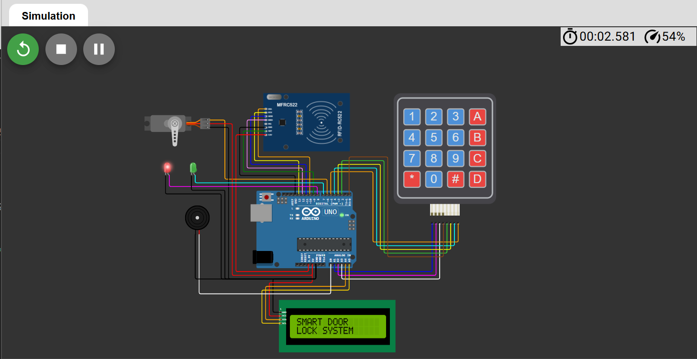
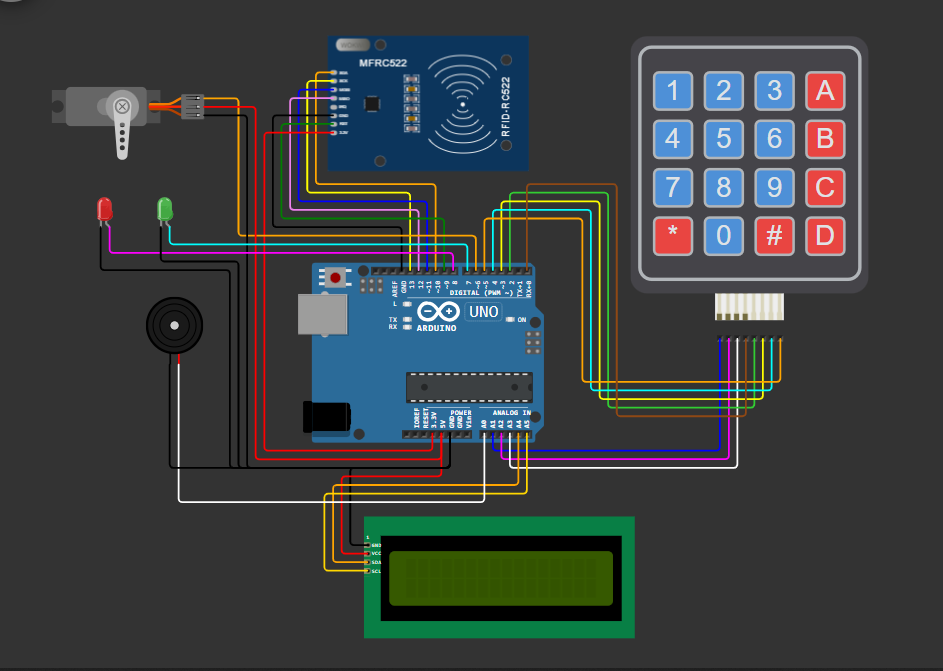
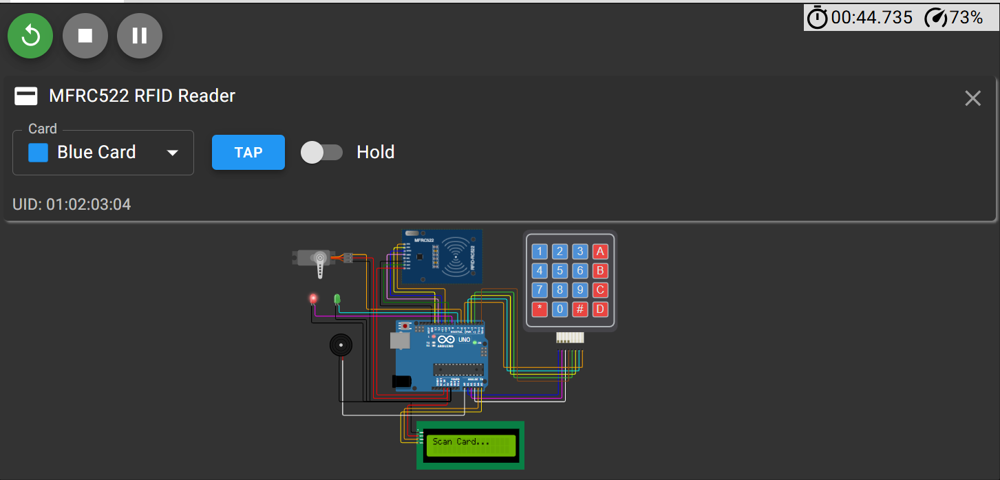
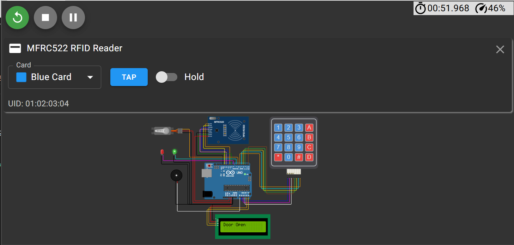
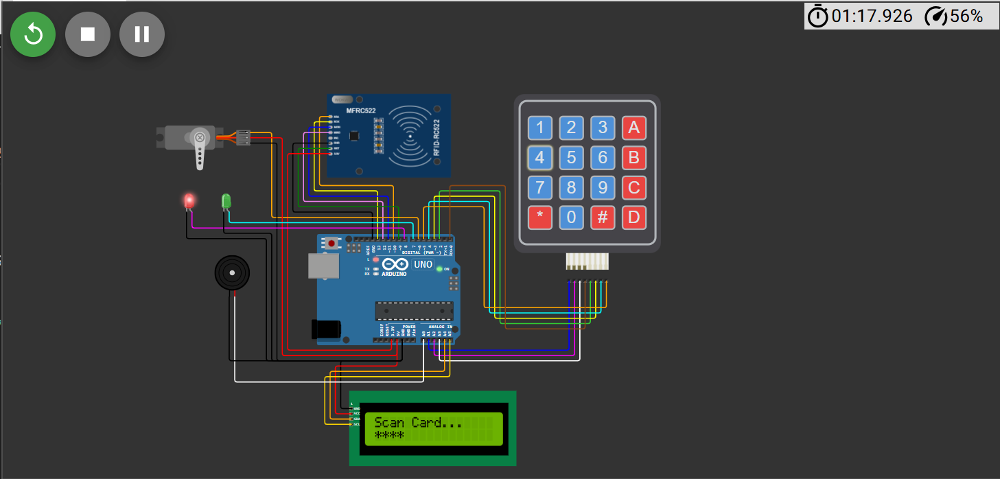
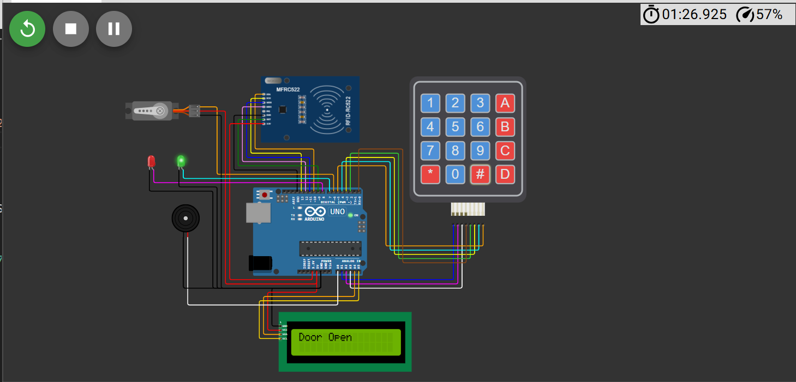

# 🔐 Smart Door Lock System

An Arduino-based smart door lock system that combines **RFID card access** and a **keypad backup password**, with real-time status feedback through an LCD display, LED indicators, and a buzzer. Built and simulated entirely in **Wokwi**.

      



---

## 📋 Overview

This project simulates a dual-authentication smart lock:

- Tap an **authorized RFID card** to unlock the door, **or**
- Enter the correct **4-digit password** on the keypad as a backup method.

On successful authentication, a servo motor rotates to simulate the door unlocking, the LCD confirms access, the green LED lights up, and a short buzzer tone sounds. On failure, the red LED stays on and the buzzer sounds an error pattern. The door auto-locks again after a few seconds.

---

## ✨ Features

- 🪪 **RFID-based access** using the MFRC522 module
- 🔢 **Keypad password backup** (4x4 membrane keypad)
- 🔊 **Audio feedback** via buzzer (success tone / error pattern)
- 💡 **Visual status indicators** using Red (locked) and Green (unlocked) LEDs
- 🖥️ **16x2 I2C LCD** showing live system status (`Scan Card...`, `Door Open`, `Access Denied`, etc.)
- ⚙️ **Servo-driven lock mechanism** with automatic re-lock after a timeout
- 🐛 Serial Monitor debug logging for keypad input and servo actions

---

## 🧰 Components Used

| Component                  | Quantity |
|-----------------------------|:--------:|
| Arduino Uno                 | 1        |
| MFRC522 RFID Reader Module  | 1        |
| RFID Card/Tag                | 1        |
| 4x4 Membrane Keypad         | 1        |
| 16x2 LCD Display (I2C)      | 1        |
| SG90 Servo Motor            | 1        |
| Buzzer                      | 1        |
| Red LED                     | 1        |
| Green LED                   | 1        |
| Jumper Wires                | As needed|

---

## 🖇️ Circuit Diagram



### Pin Connections

**MFRC522 RFID Reader (SPI)**

| RFID Pin | Arduino Pin |
|----------|-------------|
| SDA (SS) | 10          |
| SCK      | 13          |
| MOSI     | 11          |
| MISO     | 12          |
| RST      | 9           |
| GND      | GND         |
| 3.3V     | 3.3V        |

**4x4 Keypad**

| Keypad Pin | Arduino Pin |
|------------|-------------|
| R1         | A1          |
| R2         | A2          |
| R3         | A3          |
| R4         | 0 (RX)      |
| C1         | 2           |
| C2         | 3           |
| C3         | 4           |
| C4         | 5           |

**16x2 LCD (I2C)**

| LCD Pin | Arduino Pin |
|---------|-------------|
| VCC     | 5V          |
| GND     | GND         |
| SDA     | A4          |
| SCL     | A5          |

**Servo Motor**

| Servo Wire | Arduino Pin |
|------------|-------------|
| Signal     | 6           |
| VCC        | 5V          |
| GND        | GND         |

**LEDs & Buzzer**

| Component      | Pin  |
|----------------|------|
| Green LED (+)  | 7    |
| Red LED (+)    | 8    |
| Buzzer (+)     | A0   |

> ⚠️ Note: Keypad `R4` is wired to pin `0` (RX). Since the sketch only writes to Serial and never reads from it, this doesn't cause conflicts — but keep it in mind if you extend the project to use Serial input.

---

## 📦 Software & Libraries

Install these libraries via the Arduino Library Manager (or they're pre-included if you're using the Wokwi simulator with the provided `Diagram.json`):

- [`MFRC522`](https://github.com/miguelbalboa/rfid) — RFID reader communication
- [`Keypad`](https://playground.arduino.cc/Code/Keypad/) — 4x4 matrix keypad input
- [`LiquidCrystal_I2C`](https://github.com/johnrickman/LiquidCrystal_I2C) — I2C LCD display
- `Servo` — built into the Arduino core
- `SPI` / `Wire` — built into the Arduino core

---

## 🚀 Getting Started

### Option 1: Run in Wokwi (Recommended)
1. Go to [wokwi.com](https://wokwi.com) and create a new Arduino Uno project.
2. Copy the contents of [`Codes/Sketch.ino`](Codes/Sketch.ino) into the sketch editor.
3. Copy the contents of [`Codes/Diagram.json`](Codes/Diagram.json) into the diagram editor (or import the file directly).
4. Click **Start Simulation** ▶️.

### Option 2: Run on Real Hardware
1. Wire the components according to the [pin connection tables](#pin-connections) above.
2. Install the required libraries listed above via the Arduino IDE Library Manager.
3. Open `Codes/Sketch.ino` in the Arduino IDE.
4. Select **Arduino Uno** as your board and the correct COM port.
5. Upload the sketch.

### 🔑 Setting Your RFID Card UID
The sketch ships with a placeholder UID:
```cpp
byte validUID[4]={0x01,0x02,0x03,0x04};   // Replace with your RFID UID
```
To use your own card:
1. Upload the sketch and open the Serial Monitor (9600 baud).
2. Scan your card — the UID will be printed.
3. Replace the placeholder bytes in `validUID[]` with your card's actual UID.
4. Re-upload the sketch.

### 🔐 Default Password
The default backup password is **`1234`**, configurable here:
```cpp
String password="1234";
```

---

## 🖼️ Demo

### Scan Card


---

### Door Open by Card


---

### Enter Password



---

### Door Open by Password



---

## ⚙️ How It Works

1. On startup, the LCD displays a welcome message, then switches to the idle **"Scan Card..."** prompt.
2. The system continuously checks for:
   - A new RFID card tap, **or**
   - Keypad input.
3. **RFID path:** if a card is detected, its UID is compared against `validUID[]`. A match grants access; a mismatch denies it.
4. **Keypad path:** digits are collected into `inputPassword` as they're typed. Pressing `#` submits and compares against the stored `password`; pressing `*` clears the current entry.
5. On **access granted**: the green LED turns on, the red LED turns off, a success tone plays, the servo rotates to 90° (unlocked), and the LCD shows `"Door Open"`. After 5 seconds, the servo returns to 0° (locked) and the LCD shows `"Door Locked"`.
6. On **access denied**: the red LED stays on and a 3-beep error pattern plays on the buzzer.

---

## 📁 Project Structure

```
Smart-Door-Lock-System/
├── README.md
├── LICENSE
├── Images/
│    ├── Circuit-diagram.png
│    ├── Door-open-by-card.png
│    ├── Door-open-by-password.png
│    ├── Enter-password.png
│    ├── Scan-Card.png
│    └── Smart-lock.png
└── Codes/
     ├── Diagram.json
     └── Sketch.ino
```

---

## 🔮 Future Improvements

- [ ] Support multiple authorized RFID cards
- [ ] Add EEPROM storage so the password/UID survive power loss
- [ ] Replace blocking `delay()` calls with a non-blocking `millis()`-based state machine
- [ ] Add a password change / admin mode via keypad
- [ ] Log access attempts (granted/denied) with timestamps

---

## 📄 License

This project is open source and available under the [MIT License](LICENSE).

---

## 🧑‍💻 Author

**👤 Harsh Belekar**  
📍 Data Analyst | Python Developer | SQL | Power BI | Excel | Data Visualization  
📬 [LinkedIn](https://www.linkedin.com/in/harshbelekar) | 🔗[GitHub](https://github.com/Harsh-Belekar)

📧 [harshbelekar74@gmail.com](mailto:harshbelekar74@gmail.com)

---

⭐ *If you found this project helpful, feel free to star the repo and connect with me for collaboration!*
